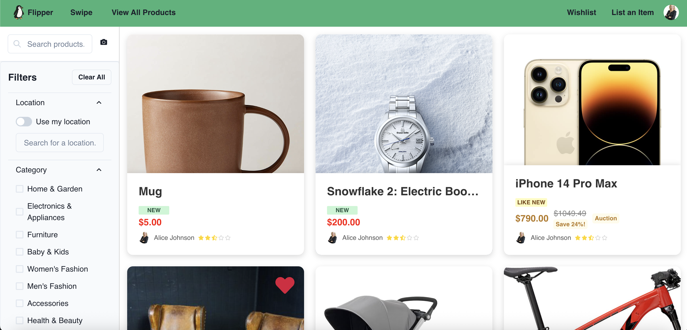
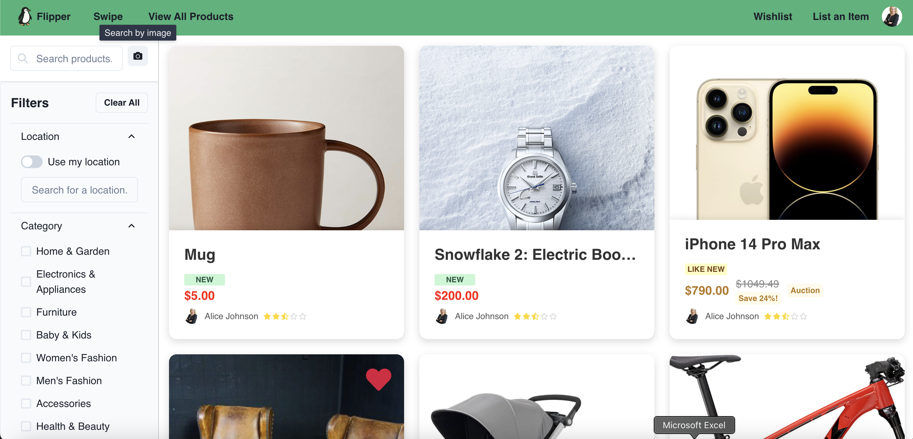
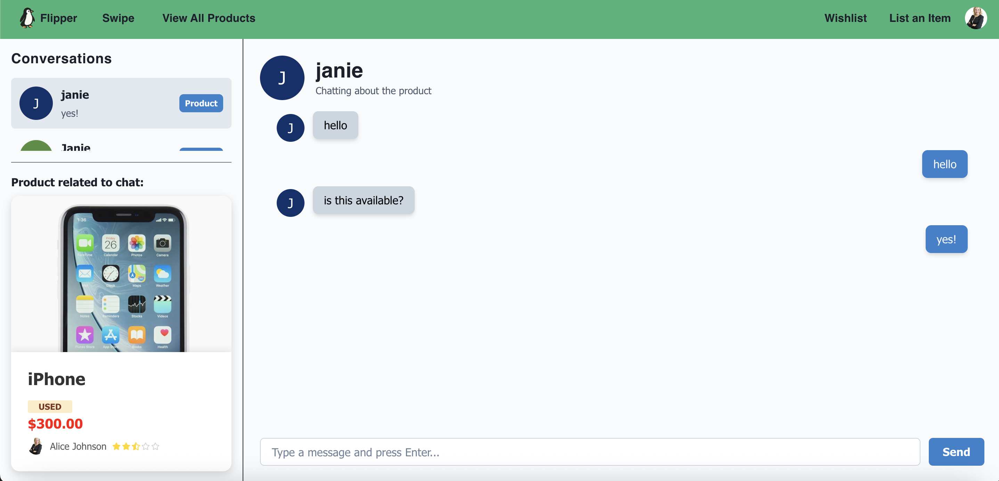
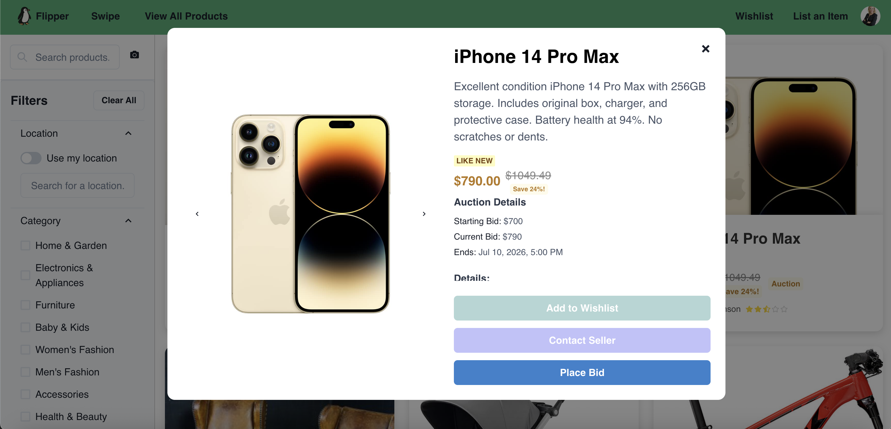
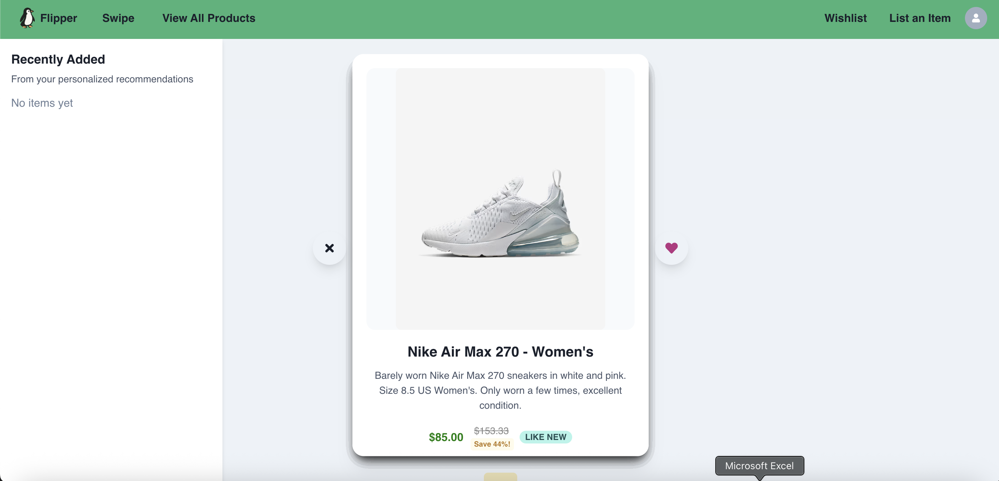

# Flipper

#### Team Name: Club Penguin (Team 29)

#### Members: Janie Holzmann, Paterson How, Dabin Im, Haider Khan, Domenic Mastromatteo

The app we've created is Flipper, a site to buy and sell used items. It uses React + TypeScript + Vite.

## App Summary

Flipper is a second-hand goods site, with a focus on product discoverability. From a seller's perspective, the site offers a user friendly but powerful interface to create new listings, and the ability to auction goods. From a buyer's perspective, the site includes a variety of filters to search for items, recommendation algorithm based off the users wishlist, and a swiping interface to scan through products to add to your wishlist.

## Minimal Goals

- COMPLETE: Browse and list items - description, price, category, condition (e.g., new, used, etc.)
- COMPLETE: Filtering + Searching options (price, rating, category, location/distance etc.)
- COMPLETE: User Login + profile
- COMPLETE: Rate users based on interactions (e.g. 5 stars)

## Standard Goals

- COMPLETE: Ability to auction items (real time or over a set period)
- COMPLETE: Image search - post a photo of the desired product, image is compared to product images in our database. Images above a certain "similarity threshold" will be returned as search results.
- COMPLETE: Swipe-style interface to browse items quickly (like Tinder/TikTok)
- COMPLETE: Relist purchased items
- COMPLETE: Messaging service
- COMPLETE: Price comparison with external platforms like Amazon (calculate discount compared to buying new - sellers who include multiple reference links will have their discount shown in a brighter color to highlight better deals and encourage cross-referencing)
- COMPLETE: Stay logged in/remember user with cookies

## Stretch Goals

- DROPPED: Auto-uploading item -- Dropped due to to lacking time and prioritization of bug fixes
- DROPPED: Connection to Doordash API to hire deliverers for items, as well as payment processing for service -- Dropped due to logisitical issues of the feature (Handling cancelled orders, fake/scam orders, orders too large for doordash, etc). 
- COMPLETE: Recommendation Algorithm

## Non-trivial Elements

- COMPLETE: A complete product lifecycle, from listed (either for direct sale or auction), to wishlisted, to sold, to relisted
- COMPLETE: An interface for searching for products that rivals current market competitors (Facebook Marketplace, Kajiji), including image-based search and swiping through recommendations
- COMPLETE: An extensive backend for both products and users to support various levels of categorization, location based searching, etc.
- COMPLETE: An in-house messaging feature to allow users to organize sales without leaving the site.

## XSS Security Assessment

To test Flipper's Security, we tried the OWASP Juice Shop XSS attack command: `<iframe src="javascript:alert(`xss`)">`, random javascript commands (such as sleep()), and more specific NoSQL injections (like {id: {"ne": "nonexistent"}}) in the following inputs:

- Product Search Bar
- Location Search Bar
- Min Price and Max Price filters
- All inputs in New Product Form
- All inputs in Edit Product Form
- All inputs in Edit Profile Form

We also tried an XSS scanner, in case we had missed any inputs or injections. Both the manual test and the automated one found no points of entry, instead the text was just submitted as plaintext. This left some time for further study, so we continued to also investigate api attacks. Here Flipper has some vulnerabilities, for example while some user information is public by nature of the app (such as the user's provided name and email as a point of contact) our api uses a single endpoint to get user information, whereas we should have a public endpoint for other users and a private one for your own page. Note that this does not include user authentication information, as that is handled through Firebase and so is not shared in our own api endpoints.

As we did not have any detected XSS vulnerabilities we have made no security specific changes this milestone.
##

_A complete bug list with labelled priorities can be found on [GitHub Issues](https://github.students.cs.ubc.ca/CPSC455-2025S/team29/issues)_

## 🐳 Running with Docker

You will need a firebase api config file in the following path:
"team29/src/backend/config/firebase-service-account.json"
If the required json file has not been provided to you and you require a docker containter, please contact one of the developers of this project.

**open docker desktop first :))**

```bash
docker-compose build
docker-compose up
```

navigate to http://localhost:5173/

## Milestone 1

For M1, we focused on building the front end of our site. The following components and pages were created:

- Home page with product cards and searching/filtering ability. Each card links to Product Details page
- Navigation bar that is across the top of all pages - provides links to User Profile, login/logout, and home page
- Product details and Product upload pages. From the Product Details page you can click Purchase to be brought to the Purchase page for a product
- Purchase page
- User profile page
- Login page

---

## Milestone 2

In Milestone 2, we focused on integrating core functionality such as Firebase authentication, user persistence, product listing logic, and wishlist handling. Compared to Milestone 1, our app has become more dynamic and personalized with the following updates:

🔑 Authentication & User State
• Integrated Firebase Authentication (login/logout, auth persistence)
• Fixed async auth state issue on page refresh by observing Firebase state and syncing with Redux
• Introduced support for guest users: conditional rendering of NavBar options and wishlist access
• Created a “dev account” path for easier testing

🧭 Navigation Bar Updates
• Navigation now dynamically reflects user login state
• Wishlist, “List an Item”, and “Swipe” options are hidden for guests
• User profile avatar shows a red badge when unread messages exist

🛍️ Wishlist Functionality
• Functional heart buttons to add/remove items from wishlist
• Wishlist page dynamically displays user’s saved items
• Accessing wishlist as guest prompts login

🏠 Homepage Improvements
• Fully functional search bar
• Condition tags added to product cards
• UI improvements (e.g., fixed layout bugs like “fat penguin”)

📦 Product Upload & Purchase
• Upload form now redirects to homepage on submit
• Upload form supports location input (basic string field for now)
• Purchase page connected with product data (Firebase integration in progress)

👤 Profile Page Enhancements
• View and manage listed items
• Ability to mark items as sold or delete listings
• Functional “Edit Profile” and “View Wishlist” buttons (some still depend on auth state)

💬 Messages
• Messaging backend integrated
• Messages tied to “Contact Seller” button on purchase page
• From Messages page, users can mark items as sold

🧪 Additional Notes
• Various TypeScript type adjustments (e.g., updated User type)
• Added Redux thunk support for async Firebase operations
• Refactored component logic to support real-time updates
• Image uploads via Imgur (temporary solution)

---

## Milestone 3

In Milestone 3, we focused on improving the quality of what we have already created, using our feedback, bug reports, and newly developed tests as direction.

- We have implemented a test suite to ensure our developed code is functioning as intended.
- We have added an api, seperating our front and back end code.
- We have made significant progress on a new feature, the recommendation algorithm, currently located as a page in the user profile (please note you need to first log in and add items to your wishlist for the algorithm to function).
- We have fixed many bugs found in previous cross-plays, and continued improving the visual design of flipper.

To run the docker container, please see the instructions contained above these milestone reports.

## Milestone 4

Milestone 4 has included many changes and improvements from M3 as we complete development on our standard requirements. Highlights include:

- A complete overhaul of our database, to better support recommendations and locations for products, and messaging for users.
- A reverse image search feature, that allows users to select an image and find similar items.
- New UI for Product adding and editing, many smaller UI improvements and bugfixes across the board. These include things such as:
  - Full dark mode compatibility
  - Ability to add price comparison links when listing a product
  - Location is auto-completed when listing a product
- Auction support for listed items.
- Recommendation algorithm implemented into home page rather than hidden behind user profile.
- Fixing of most major bugs.
- Adding test cases as needed.
- Messaging service

## Demo

### Key Features

- Product buying, selling, editing, updating functionality
  
- Basic searching and filtering, as well as searching by image
  
- Messaging users
  
- Auctioning service
  
- "Swipe" page and recommendation algorithm
  

## Milestone 5

In this milestone, there were not any major changes. We mostly just worked on bug fixing.

### Test Suite

To run tests:
(only need to have the `backend-tests` container built via `docker-compose build backend-tests`)

`docker compose run --rm backend-tests` → runs tests and saves output

Open the `./mochawesome-report/mochawesome.html` file in the browser to view results

Link to test suite: https://github.students.cs.ubc.ca/CPSC455-2025S/team29/tree/Milestone4/src/backend/tests

---

---
